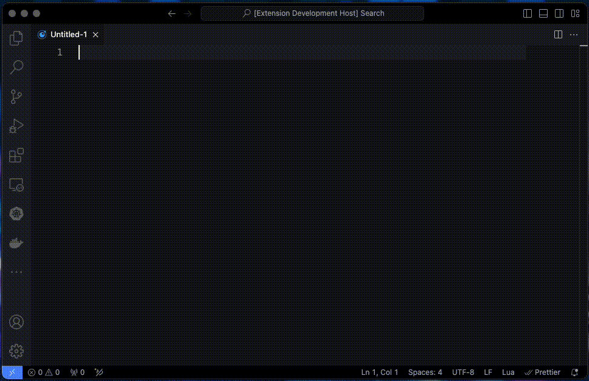

# getref README

## Features

This extension does one thing, and one thing only. It will allow you to search [dblp](https://dblp.org/) [1], and select one of the results and insert the corresponding `bibtex` entry. This is useful for quickly adding entries to a bibtex file. See also the [CLI version of getref](https://github.com/martisak/getref).



## Requirements

- Needs an Internet connection in order to reach [dblp](https://dblp.org/).

## Installation

### Via Visual Studio Code Marketplace

1. Open **Visual Studio Code**.
2. Navigate to the **Extensions** view by clicking on the square icon on the sidebar, or by pressing `Ctrl+Shift+X` (Windows/Linux) or `Cmd+Shift+X` (macOS).
3. In the search box, type `getref` to find the extension.
4. Click on the **Install** button to install the `getref` extension.

### Via Command Line

You can also install the `getref` extension using the command line interface of Visual Studio Code:

1. Open a terminal.
2. Run the following command:

   ```bash
   code --install-extension martisak.getref
   ````

### Manual Installation

If you need to install the extension manually from a VSIX file:

Download the VSIX file for the `getref` extension from the Visual Studio Code Marketplace or the extension's GitHub releases page.

1. Open Visual Studio Code.
1. Navigate to the Extensions view.
1. Click on the ... at the top-right of the Extensions view, then select Install from VSIX....
1. Locate the downloaded VSIX file and select it. Click Open to start the installation.

After installation, you might need to reload or restart Visual Studio Code to activate the `getref` extension.

### Post-Installation

After installing the `getref` extension, you can access its features via the command palette (Ctrl+Shift+P or Cmd+Shift+P) by typing `Insert dblp reference` and selecting the desired command.

For further information and support, visit the `getref` extension's page on the Visual Studio Code Marketplace or its GitHub repository.

## Extension Settings

This extension contributes the following settings:

* `getref.style`: Reference style, 0 (condensed), 1 (standard) or 2 (crossref)

## Known Issues

There are no checks on input.

## References

1. [dblp API](https://dblp.org/faq/How+to+use+the+dblp+search+API.html)
1. [getref CLI](https://github.com/martisak/getref)
1. ChatGPT, personal communication, February 10, 2024